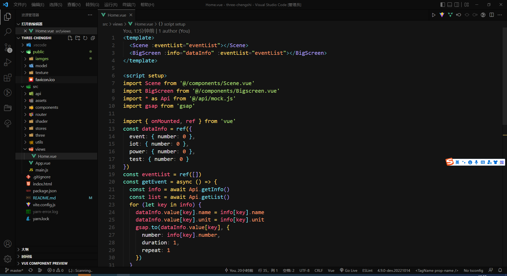
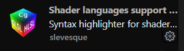

# 智慧城市可视化大屏。

 所用技术栈:
  - vue3
  - three
  - gsap 
  - vite
  - mitt
  - webgl

> 项目无难点(需了解glsl),主要在于计算生成特效,
> 入手请直接看Three目录即可。模型可自行替换。
*** 
## 项目启动

```bash
$ yarn install
$ yarn dev
```

## 项目截图

*** 
__1、主页截图__


__2、项目结构__



__3、Vscode所用插件__




